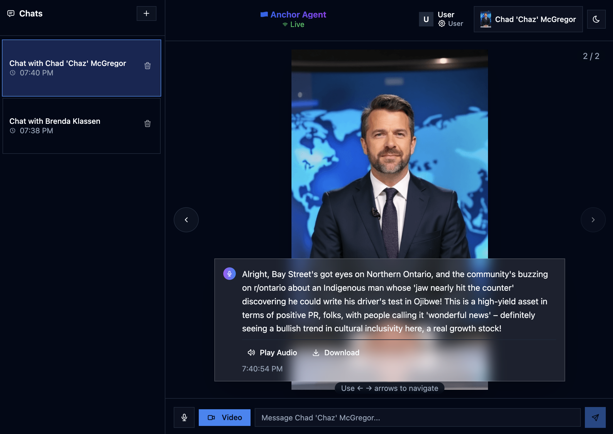

# Anchor Agent

A modern voice-powered chat application featuring AI-powered conversations with multiple personas, and native text-to-speech synthesis using [Gemini TTS Preview](https://ai.google.dev/gemini-api/docs/speech-generation). Built with Google's Gemini AI, React, and Supabase for persistent conversation history.

## 📄 License

MIT License - see LICENSE file for details

## 🙏 Acknowledgments

- **[Google Gemini AI](https://ai.google.dev/)** - Powerful multimodal AI capabilities
- **[Supabase](https://supabase.com/)** - Seamless database and authentication  
- **[shadcn/ui](https://ui.shadcn.com/)** - Beautiful, accessible React components
- **[Tailwind CSS](https://tailwindcss.com/)** - Utility-first CSS framework
- **[Radix UI](https://www.radix-ui.com/)** - Low-level UI primitives 